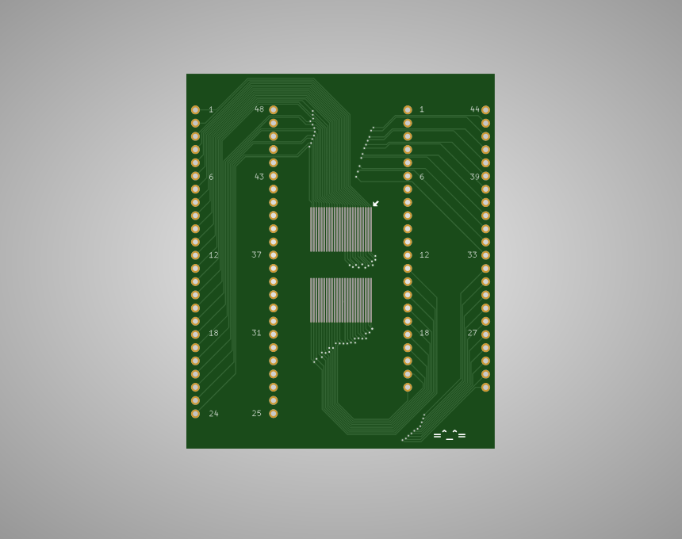
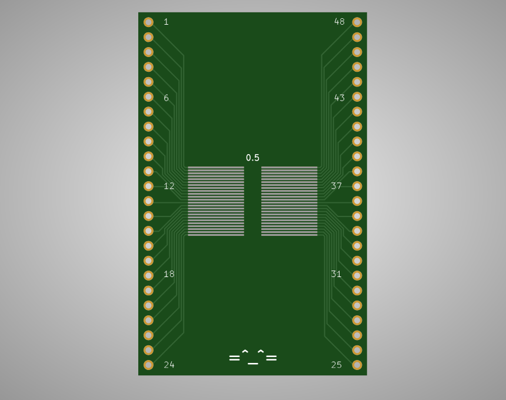
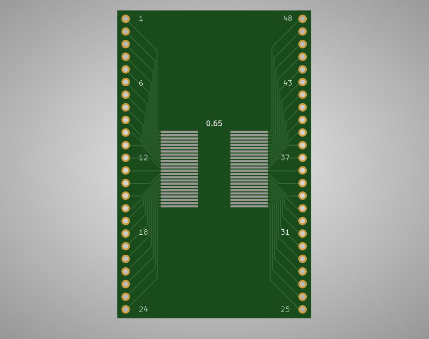
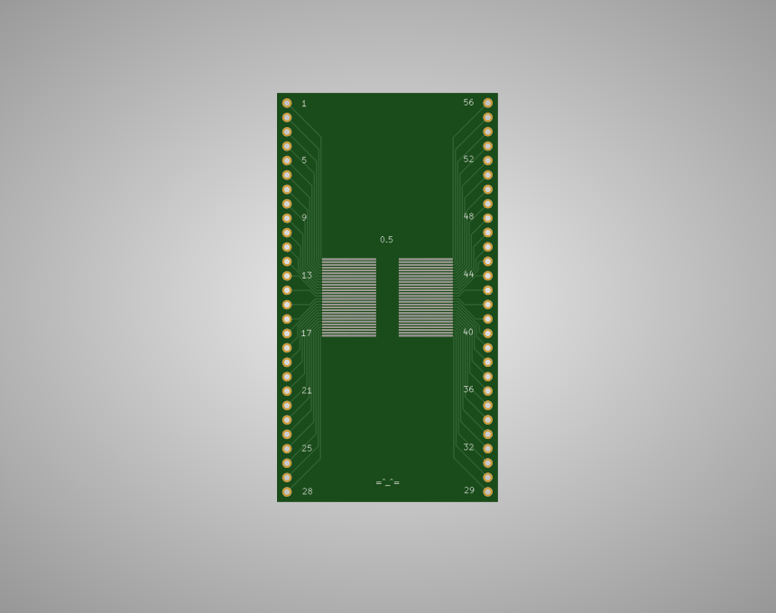
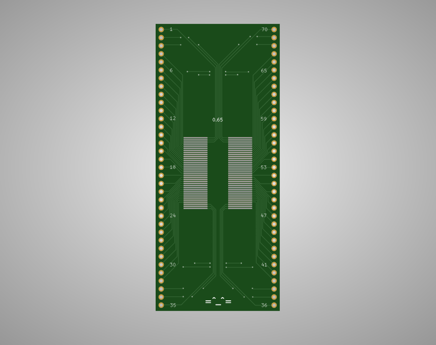
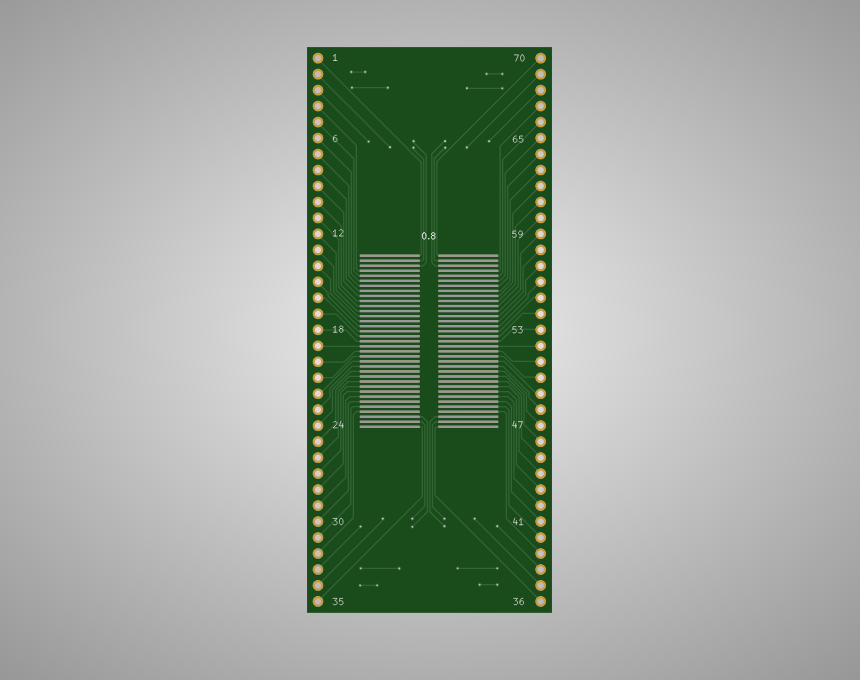
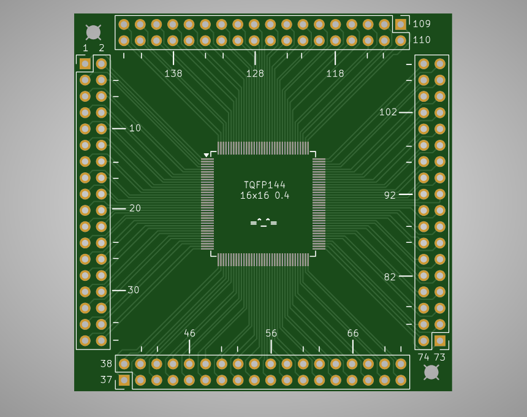

# PCBs

KiCad (gerber) files for breakout boards.

## TSOP48 0.50mm pitch + SOP44 DIP adapter

## TSOP48 0.50mm + 0.65mm pitch DIP adapter

## TSOP56 0.50mm pitch DIP adapter

## SSOP70 0.65mm + 0.80mm pitch DIP adapter

## TQFP144 16x16 0.4mm pitch DIP adapter

